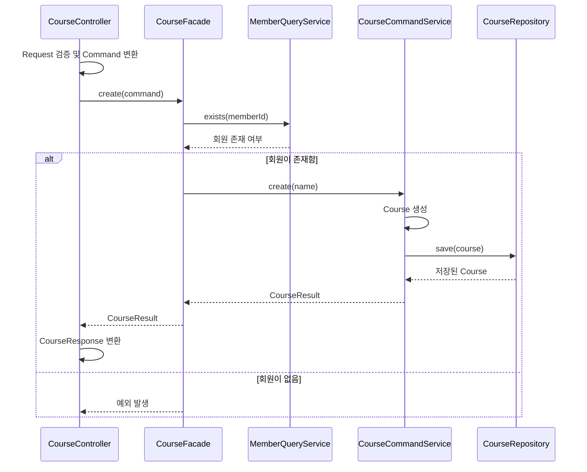

# 기본 코드 예제

회원 존재 여부를 확인한 뒤 코스를 생성하는 흐름을 보여 줍니다. 제품 명세를 구현한 API가 아닙니다.

## 읽는 순서

1. [CourseController](course/controller/CourseController.java): 입력 검증과 응답 변환
2. [CreateCourseCommand](course/service/command/CreateCourseCommand.java): 인증된 회원 ID와 요청 이름을 묶는 입력
3. [CourseFacade](course/service/CourseFacade.java): 회원 확인 후 코스 생성 조정
4. [CourseCommandService](course/service/CourseCommandService.java): 생성과 저장
5. [Course](course/entity/Course.java) / [CourseRepository](course/repository/CourseRepository.java): 생성 조건과 저장 계약

Request는 클라이언트 입력, Command는 업무 입력입니다. Controller가 서버에서 인증한 회원 ID를 Request의 이름과 묶어 Command를 만듭니다. Facade는 회원·코스 Service를 조정하고, CourseCommandService는 코스 생성과 저장을 담당합니다. 회원 확인이 필요 없는 단일 업무라면 Controller에서 Service를 바로 호출해도 됩니다.

## 검증과 트랜잭션

- Request는 잘못된 입력을 업무 실행 전에 거릅니다. Entity는 Request를 거치지 않는 호출에서도 생성 조건을 지킵니다.
- 실제 Spring Bean으로 구성하고 프록시를 통해 호출하면, 기본 전파 설정에서 CourseCommandService는 Facade가 시작한 트랜잭션에 참여합니다. 같은 트랜잭션 매니저를 사용하는 구성을 전제로 합니다.
- CourseCommandService를 단독 호출할 때도 저장 트랜잭션이 적용되도록 양쪽에 `@Transactional`을 선언했습니다. 이 예제는 Bean으로 등록하지 않으므로 실제 트랜잭션은 실행되지 않습니다.

## 생략한 부분

- 실제 인증 처리, 회원 조회 구현, DB 저장, HTTP 경로·상태 코드·오류 매핑은 다루지 않습니다. 회원 조회는 같은 DB를 사용하는 계약만 둡니다.
- 회원 확인은 Facade 조정을 설명하기 위한 단계입니다. 회원 존재 여부가 인증·권한을 보장하지 않으며, 소유자 저장과 접근 정책도 이 예제의 범위 밖입니다.
- Request의 수동 검증과 `IllegalArgumentException`은 실패 흐름을 설명하기 위한 코드입니다. 제품에는 승인된 입력 검증과 업무 오류 계약을 적용합니다.
- 파일을 한곳에서 읽도록 `apps/api` 아래에 모았습니다. 실제 모듈 배치는 [코드 규칙](../../../../../../../../docs/code-rules/README.md)을 따릅니다.

테스트는 생성·저장 결과, 잘못된 이름의 거부, 회원 확인 실패 시 저장하지 않는 동작을 확인합니다. Spring HTTP·DB 통합 테스트는 아닙니다.
