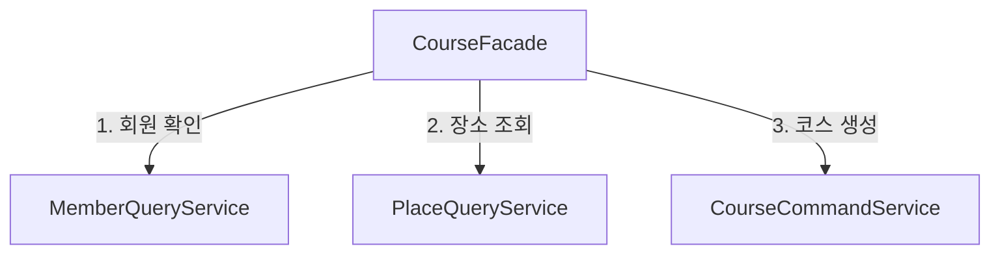

# Code Rules

이 문서는 개발자와 Agent가 함께 따르는 코드 작성·리뷰 규칙의 단일 원본입니다. 요구사항과 API·데이터 계약은 [명세 원본 규칙](specification.md)을 따릅니다.

## 작업 기준

1. 구현 전에 관련 요구사항·기능·API ID와 결정상태를 확인합니다.
2. 기존 코드와 테스트를 읽고 승인된 계약을 만족하는 최소 범위만 변경합니다.
3. 명세와 코드가 충돌하거나 기술·업무 결정이 비어 있으면 추정하지 않고 확인합니다.
4. 사용자 변경을 보존하고 요청 밖의 리팩터링과 의존성 추가를 피합니다.

## 기술 스택

| 영역 | 기준 |
| --- | --- |
| 언어·빌드 | Java 21, Gradle 9.7.1 |
| 애플리케이션 | Spring Boot 4.1.1, Spring MVC, 내장 Tomcat |
| 외부 HTTP | WebClient·Reactor. Reactive 서버 스택으로 사용하지 않음 |
| 데이터 | Spring Data JPA, PostgreSQL, Flyway |
| 배치·캐시 | Spring Batch, Spring Data Redis·Lettuce |
| 인증 | Spring Security, JJWT 0.13.0 |
| 규칙·AI | Drools 10.2.0 Rule Unit, Spring AI 2.0.0 Model API |
| 관측성 | Actuator, Micrometer Prometheus Registry |
| 품질 검사 | Spotless, Checkstyle 14.0.0, ArchUnit 1.5.0 |

- WebFlux는 외부 연동에만 사용하며 MVC 요청을 불필요하게 Reactive 흐름으로 바꾸지 않습니다.
- Batch Job Repository와 Migration은 PostgreSQL 기준으로 재현 가능하게 관리합니다.
- Redis의 캐시·세션·업무 데이터 용도는 기능 명세에서 결정합니다.
- Security 접근 정책은 `SecurityFilterChain`으로 명시합니다.
- Drools는 Rule Unit 방식을 사용하며 `kmodule.xml` 기반 구성은 승인된 요구가 있을 때만 도입합니다.
- AI 제공자와 모델은 승인 전까지 특정 Starter나 접속 설정으로 확정하지 않습니다.
- 외부에 노출할 Actuator Endpoint와 권한을 환경별로 제한합니다.

## 모듈과 패키지

모듈별 코드 배치는 다음 기준을 따릅니다.

| 위치 | 배치할 코드 |
| --- | --- |
| `apps` | 실행·배포 구성, Controller, HTTP DTO, UseCase Service, 트랜잭션, JPA 저장 구현 |
| `domains` | 공유 업무 정책, 업무 모델, 외부 구현이 필요한 저장·조회 계약 |
| `integrations` | 외부 API·메시징 Adapter |

업무 모델을 `domains`에 두면 JPA 매핑은 `apps`의 저장 구현에 둡니다. 모든 업무를 별도 Domain 모듈로 분리할 필요는 없습니다.

업무 코드는 Aggregate Root(함께 저장하고 일관성을 지키는 업무 단위)와 책임을 기준으로 나눕니다. 아래는 패키지 이름 예시이며, 모든 패키지를 미리 만들지는 않습니다.

```text
com.todayit
├─ member
│  ├─ controller
│  ├─ service
│  │  ├─ command
│  │  └─ model
│  ├─ repository
│  ├─ entity
│  ├─ dto
│  │  ├─ request
│  │  └─ response
│  └─ exception
└─ common
   ├─ config
   ├─ client
   └─ exception
```

- `controller`: HTTP Controller
- `service`: UseCase Service와 Facade
- `repository`: Aggregate Root의 저장·조회 계약과 Adapter
- `entity`: Aggregate Root, Entity와 Value Object
- `dto`: HTTP 요청·응답 모델
- `client`: 외부 API, 메시징과 외부 시스템 연계
- `common`: 실제로 여러 Aggregate가 공유하는 기술 요소

Controller·Service·Repository를 전역 패키지에 모으지 않습니다.

`repository`의 계약과 구현은 서로 다른 모듈에서 같은 패키지 이름을 사용할 수 있습니다.

## 의존성과 업무 경계

### 기본 의존 방향

- 모듈 의존은 `apps → domains`, `apps → integrations → domains` 방향입니다. Domain에서 실행 모듈이나 연동 구현을 참조하지 않습니다.
- Controller는 입력 검증과 응답 변환을 담당합니다.
- 업무 판단은 Service와 Entity에 둡니다.
- Service와 Entity는 HTTP 요청·응답 DTO에 의존하지 않습니다.
- Adapter는 업무에서 정의한 계약을 구현합니다.
- `domains` 모듈은 Web, DB, 메시징, 외부 통신 SDK에 의존하지 않습니다.
- Domain의 저장·조회 계약은 Spring Data·JPA 타입을 노출하지 않습니다.
- 현재 추천 모듈의 Drools Rule Unit은 허용된 업무 규칙 엔진입니다. 그 밖의 프레임워크 의존을 자동으로 허용한다는 뜻은 아닙니다.

### Service와 전달 모델

| 구분 | 이름 | 역할 |
|---|---|---|
| 처리 | `QueryService` | 상태를 변경하지 않고 조회 |
| 처리 | `CommandService` | 생성·수정·삭제 수행 |
| 조정 | `Facade` | 여러 Service를 조정해 하나의 기능 제공 |
| 입력 | `service.command` | 업무 실행에 필요한 값. 예: `CreateCourseCommand` |
| 결과 | `service.model` | 업무 결과나 공개 조회 값. 예: `CourseResult`, `MemberSummary` |

조회와 변경이 단순하면 하나의 `Service`에서 처리합니다. 책임이 복잡해질 때 `QueryService`와 `CommandService`로 나눕니다.

### Aggregate 간 접근

- 각 Aggregate는 자신의 Repository만 사용합니다.
- 다른 Aggregate의 Entity·Repository·HTTP DTO를 직접 참조하지 않습니다.
- 다른 Aggregate의 정보는 해당 `QueryService`를 통해 조회합니다.
- 조회 결과는 필요한 값만 담은 불변 모델로 전달합니다.
- Entity에는 다른 Aggregate 객체 대신 식별자를 보관합니다.

### 여러 Aggregate의 조정

하나의 Aggregate에서 끝나는 기능은 해당 Service가 처리합니다. 여러 Aggregate를 함께 사용하는 기능은 **대표 Aggregate의 Facade**가 조정합니다.

Facade는 각 Service를 호출하며, Repository를 직접 사용하지 않습니다.



즉시 완료할 필요가 없는 후속 처리는 도메인 이벤트를 검토하고, 재시도와 실패 처리도 함께 결정합니다.

### 불필요한 복잡성 방지

- 순환 의존이 생기면 책임과 의존 방향을 재검토합니다.
- `@Lazy`, Setter 주입, 순환 참조 허용 설정으로 순환 의존을 숨기지 않습니다.
- 실제로 필요해지기 전에는 추상화, 계층, 공유 유틸리티를 추가하지 않습니다.

## 트랜잭션과 외부 연동

### 트랜잭션 경계

- 상태 변경 트랜잭션은 Service 또는 Facade의 `public` 업무 메서드에 둡니다.
- 여러 변경을 함께 성공·실패시켜야 한다면 이를 조정하는 메서드를 트랜잭션 경계로 정합니다.
- DB 조회용 트랜잭션은 `readOnly = true`로 표시합니다. 이는 쓰기 차단을 보장하는 장치가 아니라 트랜잭션 시스템에 전달하는 힌트입니다.
- Controller와 DTO에는 트랜잭션을 두지 않습니다.
- 기본 Spring 프록시 방식에서는 같은 객체 내부 호출이나 `private` 메서드의 `@Transactional`에 의존하지 않습니다.

### 외부 호출

- 외부 네트워크 호출은 원칙적으로 DB 트랜잭션 밖에서 수행합니다.
- 외부 호출에는 타임아웃을 설정합니다.
- 재시도는 대상 오류, 횟수, 간격과 중복 실행의 안전성을 함께 결정합니다.
- 외부 작업과 DB 변경의 일관성이 필요하면 멱등성, 보상 처리 또는 Outbox 등 필요한 방식을 선택합니다.

외부 호출 결과를 저장할 때는 호출하는 상위 흐름에도 DB 트랜잭션이 없는지 확인합니다.

```java
// 이 코드를 실행하는 상위 흐름에도 DB 트랜잭션이 없어야 합니다.
ExternalPlace externalPlace = placeClient.get(placeId);

// 별도 Spring Bean의 public @Transactional 메서드를 호출합니다.
placeCommandService.upsert(externalPlace.toCommand());
```

## Java 작성 규칙

### 이름

- 기본 이름은 `{Aggregate}Controller`, `{Aggregate}Service`, `{Aggregate}Repository`입니다.
- 책임을 나눌 때는 `QueryService`, `CommandService`, `Facade`처럼 역할을 붙입니다.
- 값이 없을 수 있는 조회는 `find...`, 반드시 존재해야 하는 조회는 `get...`으로 표현합니다.
- 존재 여부는 `exists...`, 개수는 `count...`로 표현합니다.
- Boolean은 `is...`, `has...`, `can...`처럼 의미를 드러냅니다.
- Java 약어는 `ApiClient`, `UrlParser`처럼 일반 단어로 표기합니다.
- `data`, `info`처럼 대상이 드러나지 않는 이름을 피하고 `memberSummary`, `courseRequest`처럼 의미를 드러냅니다.

### 구현 방식

- Service와 Facade는 기본적으로 구체 클래스로 작성합니다. 구현 교체나 모듈 경계 분리가 필요할 때 인터페이스를 도입합니다.
- `Service`와 `ServiceImpl`을 기계적으로 분리하지 않습니다.
- Spring Bean은 생성자 주입을 사용합니다.
- 업무 의미가 있는 리터럴은 이름 있는 상수나 타입으로 표현합니다.

### 주석과 Javadoc

주석은 코드 동작을 반복하지 않고 제약과 선택 이유를 기록합니다. Checkstyle 검사 대상인 운영 코드의 `public` 타입·메서드·생성자에는 Javadoc을 작성합니다.

- 호출 조건, 보장 결과, 부수 효과를 필요한 만큼 설명합니다.
- 검사 대상의 매개변수와 반환값은 `@param`·`@return`에 짧게 설명하고, 형식·단위·범위가 있으면 함께 적습니다.
- `@throws`는 발생 조건을 설명합니다. 현재 Checkstyle의 `validateThrows = true` 검사 대상 예외를 포함하고, 호출자가 알아야 할 전파 예외도 기록합니다.
- 테스트, 비공개 구현, 의미가 명확한 Getter·Setter와 계약을 그대로 따르는 `@Override`는 Javadoc을 생략할 수 있습니다. 정확한 검사 범위는 [Checkstyle 설정](../../config/checkstyle/checkstyle.xml)과 [제외 설정](../../config/checkstyle/suppressions.xml)을 따릅니다.
- 작성자·작성일·변경 이력, 미확정 규칙과 검사 통과용 문구를 적지 않습니다.

### 포맷

- 포맷과 import는 Spotless의 Google Java Format을 따릅니다.

## API, DTO와 예외

### API 계약과 입력 검증

- API 경로, 요청·응답, 상태 코드와 오류 형식은 승인된 명세를 따릅니다.
- 입력 형식·필수 값·범위·필드 간 조건은 Controller 경계에서 검증합니다.
- 권한, 중복, 상태 전이처럼 업무 데이터가 필요한 판단은 Service와 Entity에서 수행합니다.
- 상태 변경 API는 중복 요청 처리와 멱등성 기준을 결정합니다.
- 목록 API는 페이지·정렬 기준을 결정합니다.
- 공개 계약을 깨는 변경에는 버전 또는 호환 전략이 필요합니다.

### DTO 변환

DTO는 경계의 데이터 전달과 단순 변환만 담당합니다. 입력·결과 타입의 위치는 앞 절의 Service와 전달 모델 기준을 따릅니다.

- Request DTO는 입력 검증과 Command로의 필드 변환만 수행합니다. 입력이 단순하면 Command 없이 개별 값으로 전달해도 됩니다.
- Request의 변환은 `toCommand()`, Response의 정적 팩터리는 `from(result)`로 표현합니다.
- Response에서 Entity를 생성하지 않습니다.
- DTO에서 Repository·Service·외부 API를 호출하거나 권한·중복·상태 전이를 판단하지 않습니다.
- 불변 모델이 컬렉션을 받으면 방어적 복사로 후속 변경을 막습니다. 컬렉션 요소도 불변인지 확인합니다.
- Service는 업무 결과를 조합하고, Controller 또는 웹 Assembler가 HTTP Response로 변환합니다.
- 자동 매핑 라이브러리는 이점이 확인될 때만 도입합니다.

### 예외 처리

- 업무 예외는 Aggregate별 `exception` 패키지에 두고 공통 `BusinessException`과 안정적인 `ErrorCode`로 구분합니다.
- `ErrorCode`는 Spring의 `HttpStatus`에 의존하지 않습니다. `@RestControllerAdvice`가 승인된 HTTP 상태와 오류 응답으로 변환합니다.
- 업무 오류 메시지는 외부 공개용으로 정의한 것만 반환합니다.
- Repository·외부 SDK의 기술 예외, 내부 메시지, SQL과 Stack Trace를 HTTP 응답에 노출하지 않습니다.
- 예상하지 못한 예외는 추적 ID로 서버 로그와 연결합니다.
- 같은 예외를 여러 계층에서 반복해서 기록하지 않습니다.
- HTTP 밖의 Batch·비동기 실행 경계는 별도의 실패 처리와 관측 규칙을 둡니다.


## 데이터베이스

- 스키마 변경은 Flyway Migration으로 재현 가능하게 관리합니다.
- 참조 무결성, 삭제 동작, 시간대와 시간 정밀도를 명시합니다.
- 생성·수정 시각과 처리자 등 감사 정보의 필요 여부와 기록 주체를 결정합니다.
- N:M 관계는 관계 테이블로 표현합니다. 관계 자체에 업무 의미와 독립적인 생명주기가 있다면 일관성 경계를 검토하여 별도 Aggregate 여부를 결정합니다.
- 인덱스는 실제 조회·정렬 근거로 추가합니다.
- Soft Delete는 복구·감사 요구가 있을 때만 사용합니다.
- 데이터 손실 가능성이 있는 Migration에는 사전 검증과 복구 계획이 필요합니다.
- ORM Entity를 API 계약으로 노출하거나 Aggregate 외부에서 내부 Entity를 개별 저장하지 않습니다.
- PK 방식과 세부 명명 규칙은 데이터 명세가 결정하기 전까지 확정하지 않습니다.

## 테스트

- 테스트 하나는 하나의 관찰 가능한 행위나 업무 규칙을 검증합니다.
- 준비·실행·검증 단계를 읽을 수 있게 구분합니다.
- 기능에 해당하는 정상 흐름, 경계값, 실패, 권한 거부와 중복 요청을 검증합니다.
- 버그 수정에는 가능하면 회귀 테스트를 추가합니다.
- 시간·식별자 생성·외부 호출이 테스트 결과에 영향을 주면 테스트에서 제어할 수 있게 분리합니다.
- Mock은 외부 경계를 격리하는 데 사용하며 내부 호출 순서를 과도하게 고정하지 않습니다.
- DB, 직렬화와 외부 Adapter 계약은 필요한 수준의 통합 테스트로 확인합니다.
- 예외 테스트는 가능한 경우 타입과 `ErrorCode`를 함께 검증합니다.
- 커버리지 수치보다 중요한 분기와 실패 가능성이 높은 흐름을 우선합니다.

## 보안

### 비밀정보와 개인정보

- 비밀키, 토큰, 접속 비밀번호 등 비밀 설정은 코드에 저장하지 않고 실행환경이나 비밀 저장소에서 주입합니다.
- 비밀값과 실제 개인정보를 테스트 데이터나 로그에 포함하지 않습니다. 개인정보를 코드에 하드코딩하지 않습니다.
- 사용자 비밀번호는 비밀번호 저장용 단방향 해시로 저장합니다.
- 내부 로그에는 추적 ID와 진단에 필요한 예외 정보를 기록할 수 있지만, 비밀값·개인정보와 민감한 요청·응답 본문은 제외합니다.

### 인증과 권한

- 인증 성공과 리소스 접근 권한을 별도로 검증합니다.
- 조회·수정 대상의 사용자·조직 범위를 서버에서 확인합니다.
- 인증·권한 검증에 실패하면 접근을 허용하지 않습니다.

### 외부 입력과 연동

- SQL 값은 문자열 결합 대신 매개변수 바인딩을 사용합니다. 동적 테이블·컬럼명은 허용 목록으로 제한합니다.
- 외부 명령은 셸 문자열 결합을 피하고 실행 파일과 인자를 분리합니다. 허용할 명령과 인자도 검증합니다.
- 동적 파일 경로는 정규화하고 허용한 디렉터리 밖으로 접근하지 못하게 검사합니다.
- 외부 URL은 허용 대상과 Redirect 목적지를 검증하고, 허용하지 않은 내부망 접근을 차단합니다.
- 파일 업로드는 크기, 형식, 이름, 저장 경로와 악성 콘텐츠 위험을 검증합니다.
- 외부 의존성과 GitHub Action을 추가할 때 출처, 권한과 공급망 위험을 검토합니다.

## 검증

```text
Windows        gradlew.bat check
macOS·Linux    ./gradlew check
포맷 확인      gradlew.bat spotlessCheck
포맷 적용      gradlew.bat spotlessApply
```

`check`는 컴파일, 테스트, Spotless, Checkstyle과 ArchUnit 검사를 실행합니다. 자동 검사로 판단할 수 없는 Aggregate 소유권과 업무 의미는 코드 리뷰에서 확인합니다.

## 기본 예제

[간단한 생성 흐름](../../apps/api/src/main/java/com/todayit/example/README.md)에서 Command로 입력을 전달하고 Facade가 회원 확인과 코스 생성을 조정하는 과정을 확인합니다. 예제는 제품 명세 구현이 아니며 생략한 운영 구성을 함께 설명합니다.

## 관련 문서

- [명세 원본 규칙](specification.md)
- [Git Convention](../CONVENTION.md)
- [Git Workflow](../WORKFLOW.md)
- [Agent 진입점](../../AGENTS.md)
